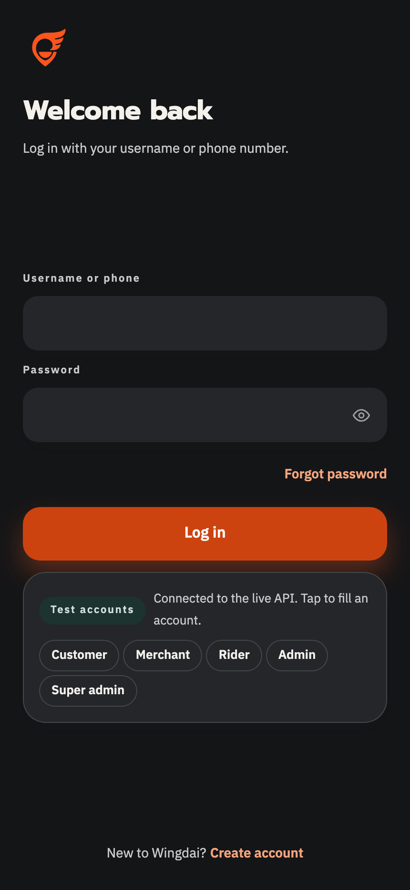
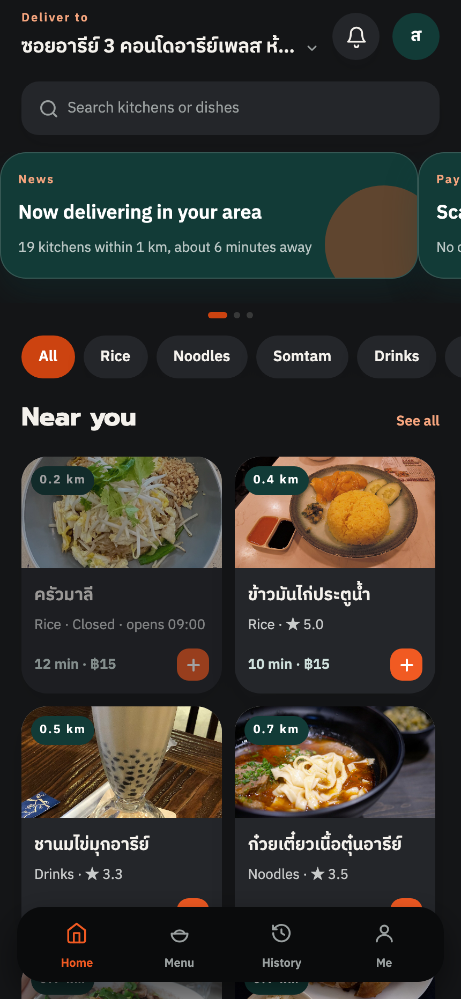
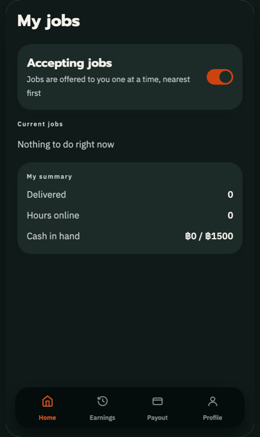
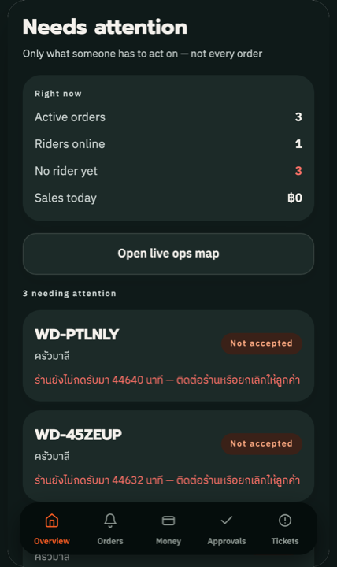
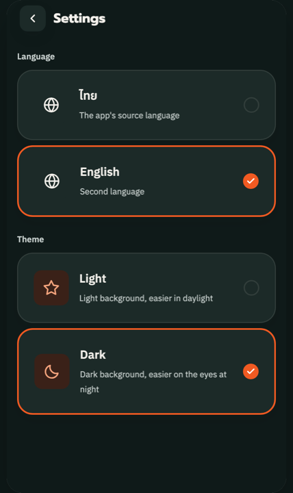

# Wingdai

[](https://github.com/44Euro/Wingdai/actions/workflows/ci.yml)

A hyperlocal food-delivery platform for Thailand — React Native (Expo) app and a NestJS API on
Postgres/PostGIS, built as a single monorepo.

> แพลตฟอร์มส่งอาหารแบบโซนหนาแน่น — แอปเดียวรองรับลูกค้า ร้าน ไรเดอร์ และแอดมิน

The product thesis is what drives the engineering: deliveries only pay for themselves when the
average trip is 1–1.5 km inside one dense zone. Short trips let a rider finish 4–5 orders an hour
instead of ~2, and that efficiency is what funds a **15% commission instead of the industry's
30–35%** — which means restaurants don't inflate menu prices, which means the customer pays the
same price as walking into the store.

Most of the non-obvious decisions below exist to protect that.

---

## Try it

**[▶ wingdai.vercel.app](https://wingdai.vercel.app)** — no install, no signup. The login screen
offers a one-tap test account for each of the four roles.

It talks to a real deployment, not a fixture: the app calls
[the NestJS API](https://wingdai-api.vercel.app/api/health), which reads a live Postgres + PostGIS
database on Supabase.

| Role | Username | Password | What you get |
|---|---|---|---|
| Customer | `somchai` | `wingdai1234` | browse, cart, checkout, live tracking, receipts |
| Merchant | `malee` | `wingdai1234` | incoming orders, menu and stock, store hours, payouts |
| Rider | `rider_ann` | `wingdai1234` | go online, job offers, earnings, cash ceiling |
| Admin | `admin_root` | `wingdai1234` | exception queue, refunds, approvals, payouts |
| Super admin | `super_root` | `wingdai1234` | commission + fee config, feature flags, audit log |

<p align="center">
  
  
  
  
  
</p>

The app probes `/api/health` at boot and uses the API when it answers. When it doesn't — the
database is asleep, the deploy is mid-rollout — it falls back to in-memory seed data and relabels
itself a demo instead of filling every screen with errors. One decision, made once, in
[`src/data/index.ts`](apps/mobile/src/data/index.ts); no screen knows which source it got. Both
paths have tests, because a fallback nobody exercises is a fallback that doesn't work.

---

## What's built

One React Native app serves four roles. Roles are **capabilities on an account**, not separate
account types — a customer can open a restaurant and switch into the merchant stack without
re-registering, and a rider can also order food.

| Role | Screens |
|---|---|
| Customer | browse, search, cart, checkout, PromptPay, live tracking, order history, receipts, report a problem, addresses, payment method |
| Merchant | order queue with accept countdown, order detail, menu + sold-out toggle, sales summary, restaurant registration |
| Rider | application + approval flow, go online/offline, 15-second job offers, active job, earnings + delivery history |
| Admin | exception dashboard, semi-automated refund decisions, restaurant and rider approvals, rider cash settlement, manual dispatch override |

Backend: auth (argon2id + JWT, username-or-phone login, phone OTP, Google sign-in), catalog,
orders with a state machine, pricing, double-entry ledger, auto-dispatch, refunds, admin.

---

## Decisions worth reading the code for

**Money is an integer number of satang, everywhere.** No floats anywhere between the API and the
ledger. There is a test that fails on any non-integer amount.

**The ledger is double-entry and append-only.** Every completed order writes balanced entries in
the *same* `db.transaction()` as the order status change. Corrections are reversal entries, never
`UPDATE`. The property test in [`postOrder.test.ts`](services/core-api/src/ledger/postOrder.test.ts)
generates many order shapes and asserts `debits === credits` — it's what caught a bug where the
gateway fee was being credited to revenue, making cash and PromptPay look equally profitable.

**The server computes every price; the client never sends one.** Order creation takes menu item
ids and quantities. A modified client could otherwise buy a ฿500 dish for ฿1, and the 15%
commission would be charged against the fake number — the restaurant would lose real money to a
value the customer typed.

**Auto-dispatch scores riders instead of racing them.** No shared job pool: jobs are offered to one
rider at a time, 15 seconds each. The scoring formula in the product spec was unusable as literally
written (`1/distance` explodes as distance → 0, and the terms had incompatible units), so
[`scoring.ts`](services/core-api/src/dispatch/scoring.ts) normalises every term to 0–1 and
documents each deviation. Hard eligibility gates live in a
[separate module](services/core-api/src/dispatch/eligibility.ts) so a "never" can't be outvoted by
a high score.

**A Thai national ID is checked by its real checksum, not its length.** Any 13 digits pass a
length check; only 1 in 10 pass the checksum, so typos and invented numbers are caught before an
admin ever sees them. Expired licences and insurance are rejected at submission too — otherwise
`eligibility.ts` would silently stop offering that rider jobs and they would never learn why.

**Riders never front money.** Cash collected by a rider is platform money held in
`rider_cash_held`, not a loan from the rider — and it flows back: an admin records the handover,
which credits `rider_cash_held` and debits `cash` in the same transaction as the balance change.
Without that leg a rider silently hits the ฿1,500 ceiling and stops being offered cash work
forever, which is exactly the bug the smoke suite was hiding by zeroing the column with raw SQL. If a customer picks cash and can't pay, the app
offers to switch that order to PromptPay — it never suggests a personal transfer to the rider,
because money that skips the ledger silently breaks daily reconciliation.

**"Unknown" is rendered as absent, never as a placeholder number.** A restaurant nobody has
reviewed shows no rating chip rather than a fake `★ 4.8`; a rider who has never been online gets
`—` for orders/hour rather than `0`, which reads as "did badly".

**Dark mode and Thai/English from the first commit**, both through a semantic token layer
(`bg-surface`, `text-primary`, …) rather than raw palette values. Riders work at night; a bright
screen while driving is a safety issue. Retrofitting either would mean editing every file.

---

## Stack

| Layer | Choice | Why |
|---|---|---|
| App | React Native + Expo SDK 57 | one codebase, OTA updates via EAS |
| Navigation | React Navigation | a stack per role |
| Server state / client state | TanStack Query / Zustand | |
| Forms | react-hook-form + zod | |
| Maps | MapLibre + Protomaps | Google Maps bills per map load, and tracking screens are stared at for minutes |
| API | NestJS 11 (Node 22) | modular monolith: auth, catalog, orders, payment, ledger, dispatch |
| DB access | Drizzle ORM | SQL-first, real transactions, clean raw-SQL escape hatch for PostGIS |
| Database | Supabase Postgres + PostGIS | managed data plane only — no business logic in Edge Functions or plpgsql |
| Token storage | expo-secure-store | Keychain/Keystore; a 30-day session token must not sit in a plain file |

Supabase Auth is deliberately **not** used: login accepts a username *or* a phone number, which
would mean faking synthetic emails. Auth is argon2id + JWT issued by the API.

---

## Running it

### Web (fastest — no native build needed)

```bash
cd apps/mobile
npm install
npm run web
```

The app runs against an in-memory mock repository by default, so it works with no backend and no
database. On web it is framed to phone width; `maplibre-gl` replaces the native map renderer, the
session token falls back to `localStorage`, and Google sign-in is hidden rather than shown as a
button that would error.

### iOS / Android

Needs a dev build — MapLibre, Google Sign-In and secure-store are native modules, so Expo Go
won't work.

```bash
cd apps/mobile
npx expo run:ios     # or: npx expo run:android
```

### With the real API

```bash
cd services/core-api
cp .env.example .env        # fill in DATABASE_URL / DATABASE_POOL_URL / JWT_SECRET
npm install && npm run db:setup && npm run db:seed
npm run dev

# then point the app at it
cd ../../apps/mobile
EXPO_PUBLIC_WINGDAI_API_URL=http://localhost:3000/api npx expo start
```

Screens never import backend types directly — they go through
[`src/data/repositories`](apps/mobile/src/data/repositories), so swapping the mock repo for the
HTTP one is a one-file change.

### Deploying

Two Vercel projects, both from this repo:

```bash
# API — Vercel runs dist/main.js as a normal Node server, so the connection pool
# and shutdown hooks in db.module.ts work exactly as they do locally
cd services/core-api && vercel deploy --prod

# web — the API URL must be an EXPO_PUBLIC_ variable, since that is the only kind
# Expo inlines into the bundle at build time
cd apps/mobile
EXPO_PUBLIC_WINGDAI_API_URL=https://wingdai-api.vercel.app/api npx expo export --platform web
cd dist && vercel deploy --prod
```

The web build needs `!assets/node_modules` in `dist/.vercelignore`: Expo emits the bundled fonts
under a path containing `node_modules`, which Vercel skips by default. Without it every font 404s,
the SPA rewrite answers with `index.html`, and the app hangs on a blank screen waiting for fonts
that will never parse.

---

## Tests

```bash
cd apps/mobile       && npx jest            # 820 tests — screens, stores, pricing, i18n, contrast
cd services/core-api && npm test            # 265 tests — ledger properties, dispatch scoring, refunds
cd services/core-api && npm run api:smoke   # 363 checks against a live database
cd apps/mobile       && npm run api:check   # 229 checks that the app's repo contract matches the API
```

The first two run in CI on every push — no database or secrets needed, because they're pure logic.
The last two need a live database and are run by hand; they're the ones that catch integration
mistakes, so they gate "done" rather than the build.

`api:check` is the suite that has caught the most real bugs — it drives the same repository
interface the screens use against the running API, so a shape mismatch fails there rather than in
the UI.

---

## Not done yet

An honest list, because a portfolio that claims to be finished is easy to disprove:

- **Real payments.** PromptPay and card are mocked screens — the payment gateway hasn't been
  chosen, so no money moves. The ledger models the gateway fee as its own account, so wiring a real
  provider is an integration, not a redesign.
- **SMS.** OTP codes are printed to the server log instead of being sent.
- **Automatic reconciliation.** The ledger is double-entry and correct, but the daily settlement
  comparison against a gateway report isn't built — it has nothing to compare against yet.
- **Realtime.** Rider location and the merchant queue poll on an interval; the spec calls for
  WebSocket push and that swap hasn't happened.
- **Maps in production.** Tiles come from OpenStreetMap's raster server and routes from the public
  OSRM demo. Both are fine for a prototype and explicitly against policy for production traffic —
  the replacements (self-hosted `.pmtiles` and OSRM) are a hosting decision, not a code change.
- **Not in an app store.** The web build is deployed and public, but store submission needs a PDPA
  data controller identity — a legal fact rather than an engineering one.
- **Shared demo state.** Everyone hits the same database, so anything one visitor changes the next
  visitor sees. Fine for a portfolio, wrong for anything else.

---

## Repo layout

```
apps/mobile           React Native + Expo — role-based stacks, UI primitives, i18n
services/core-api     NestJS — auth, catalog, orders, ledger, dispatch, refunds, admin
docs/design           design system spec
docs/product-spec.md  product and engineering rules the code is written against
```

Code comments are in Thai. They explain *why* a rule exists rather than restating what the line
does, since most of these rules cost money or trust when they're broken.
