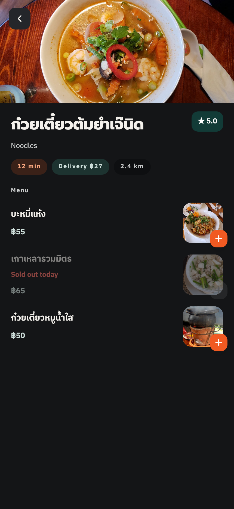
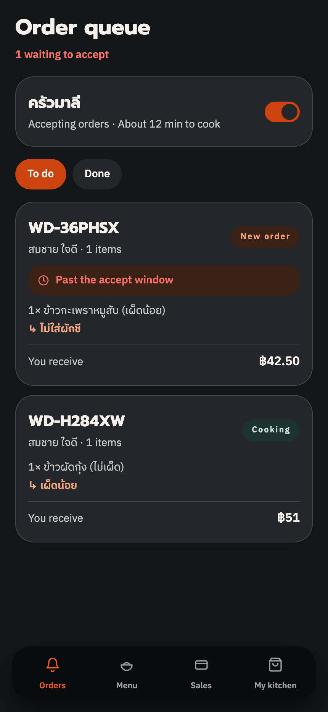
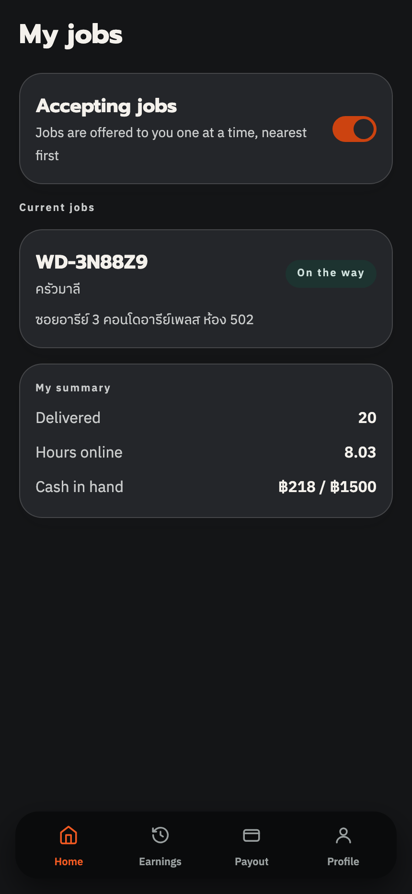
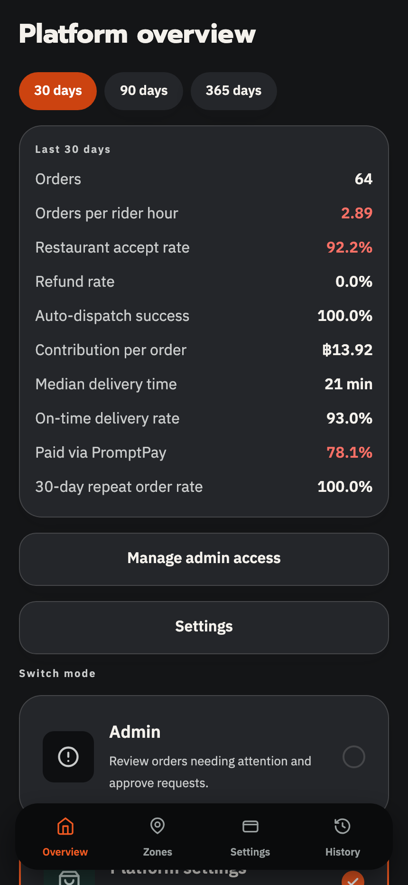

# Wingdai

[](https://github.com/44Euro/Wingdai/actions/workflows/ci.yml)

**[Read in English →](README.md)**

แพลตฟอร์มส่งอาหารสำหรับไทย อยู่ในรีโปเดียว แอป React Native (Expo) ตัวเดียวรองรับทั้งสี่บทบาท
และ API เขียนด้วย NestJS บน Postgres/PostGIS

ทั้งโปรเจคตั้งอยู่บนตัวเลขเดียว การส่งอาหารจะคุ้มก็ต่อเมื่อระยะเฉลี่ยอยู่ที่ 1–1.5 กม.
ภายในย่านเดียวที่คนอยู่หนาแน่น ระยะเท่านี้ไรเดอร์วิ่งได้ 4–5 ออเดอร์ต่อชั่วโมง แทนที่จะได้ราว 2
และความคุ้มตรงนี้เองที่ทำให้เก็บค่าคอมมิชชัน **15% แทน 30–35%** อย่างที่เจ้าใหญ่เก็บกันได้
ร้านที่จ่าย 15% ไม่ต้องบวกราคาหน้าเมนูให้แพงกว่าหน้าร้าน ลูกค้าจึงจ่ายเท่ากับเดินไปซื้อเอง

การตัดสินใจแปลก ๆ ที่เขียนไว้ข้างล่างส่วนใหญ่ มีไว้เพื่อรักษาตัวเลขนี้

---

## ลองเล่น

**[▶ wingdai.vercel.app](https://wingdai.vercel.app)** ไม่ต้องติดตั้ง ไม่ต้องสมัคร
หน้าล็อกอินมีปุ่มบัญชีทดลองของทุกบทบาทให้กดเข้าเลย

ที่เห็นคือของจริง ไม่ใช่ข้อมูลปลอมในเครื่อง แอปยิงไป
[API ตัวจริง](https://wingdai-api.vercel.app/api/health) ซึ่งอ่านฐาน Postgres + PostGIS บน Supabase

| บทบาท | ชื่อผู้ใช้ | รหัสผ่าน | ได้เห็นอะไร |
|---|---|---|---|
| ลูกค้า | `somchai` | `wingdai1234` | เลือกร้าน ตะกร้า จ่ายเงิน ติดตามสด ใบเสร็จ |
| ร้านอาหาร | `malee` | `wingdai1234` | ออเดอร์เข้า เมนูและของหมด เวลาเปิดปิด ยอดโอน |
| ไรเดอร์ | `rider_ann` | `wingdai1234` | เปิดรับงาน งานที่ยิงเข้ามา รายได้ เพดานเงินสด |
| แอดมิน | `admin_root` | `wingdai1234` | คิวออเดอร์มีปัญหา คืนเงิน อนุมัติร้าน/ไรเดอร์ เคลียร์เงินสด |
| ซูเปอร์แอดมิน | `super_root` | `wingdai1234` | ตั้งค่าคอมมิชชันและค่าธรรมเนียม สวิตช์ระบบ ประวัติการแก้ |

<p align="center">
  
  
  
  
  
  
</p>

ตอนเปิดแอปจะยิง `/api/health` ก่อน ถ้าตอบก็ใช้ API ถ้าไม่ตอบ (ฐานหลับ หรือกำลัง deploy ค้างอยู่)
จะตกไปใช้ข้อมูลตัวอย่างในหน่วยความจำ แล้วขึ้นป้ายว่าเป็นโหมดสาธิต แทนที่จะโยน error เต็มทุกจอ
ตัดสินใจครั้งเดียวที่ [`src/data/index.ts`](apps/mobile/src/data/index.ts) จอไหนก็ไม่รู้ว่าตัวเองได้ข้อมูลมาจากทางไหน
ทั้งสองทางมีเทสต์ เพราะทางสำรองที่ไม่มีใครเคยเดินคือทางสำรองที่ใช้ไม่ได้

---

## ทำอะไรไปแล้วบ้าง

แอปตัวเดียว สี่บทบาท บทบาทเป็น **ความสามารถที่ติดอยู่กับบัญชี** ไม่ใช่ชนิดของบัญชี
ลูกค้าจึงเปิดร้านแล้วสลับเข้าโหมดร้านได้โดยไม่ต้องสมัครใหม่ และไรเดอร์ก็สั่งข้าวกินได้เหมือนคนอื่น

| บทบาท | จอที่มี |
|---|---|
| ลูกค้า | เลือกร้าน ค้นหา ตะกร้า จ่ายเงิน PromptPay ติดตามสด ประวัติ ใบเสร็จ แจ้งปัญหา ที่อยู่ วิธีจ่ายเงิน |
| ร้านอาหาร | คิวออเดอร์พร้อมนับถอยหลังกดรับ รายละเอียดออเดอร์ เมนูและปุ่มของหมด สรุปยอดขาย สมัครเปิดร้าน |
| ไรเดอร์ | สมัครและรออนุมัติ เปิด/ปิดรับงาน งานที่ยิงเข้ามา 15 วินาที งานที่กำลังทำ รายได้และประวัติ |
| แอดมิน | จอออเดอร์มีปัญหา คืนเงินกึ่งอัตโนมัติ อนุมัติร้านและไรเดอร์ เคลียร์เงินสด สั่งจ่ายงานเอง |

ฝั่งเซิร์ฟเวอร์: ล็อกอิน (argon2id + JWT เข้าด้วยชื่อผู้ใช้หรือเบอร์ ยืนยัน OTP เข้าด้วย Google)
แคตตาล็อก ออเดอร์ที่มี state machine การคิดราคา บัญชีคู่ จ่ายงานอัตโนมัติ คืนเงิน และงานแอดมิน

---

## เรื่องที่คิดมาแล้ว และเปิดโค้ดดูได้

**เงินเป็นสตางค์จำนวนเต็มทุกที่** ไม่มี float โผล่ที่ไหนเลยตั้งแต่ API ถึงสมุดบัญชี
และมีเทสต์ที่แดงทันทีถ้าเจอจำนวนที่ไม่ลงตัว

**สมุดบัญชีเป็นบัญชีคู่และเขียนแล้วห้ามลบ** ทุกออเดอร์ที่จบลงบัญชีในธุรกรรม `db.transaction()`
*ก้อนเดียวกัน* กับที่เปลี่ยนสถานะออเดอร์ แก้ผิดด้วยการลงรายการกลับทาง ไม่ใช่ `UPDATE`
เทสต์เชิงคุณสมบัติใน [`postOrder.test.ts`](services/core-api/src/ledger/postOrder.test.ts)
สุ่มรูปแบบออเดอร์จำนวนมากแล้วบังคับว่า `debits === credits`
ตัวนี้เองที่จับบั๊กตอนค่าธรรมเนียมเกตเวย์ถูกลงเข้าฝั่งรายได้ ทำให้เงินสดกับ PromptPay ดูกำไรเท่ากันทั้งที่ไม่ใช่

**เซิร์ฟเวอร์คิดราคาเองทุกบาท แอปไม่เคยส่งราคามา** ตอนสั่งอาหารแอปส่งแค่ id ของเมนูกับจำนวน
ไม่งั้นคนที่แก้แอปเองจะซื้อจานละ ฿500 ในราคา ฿1 ได้ แล้วค่าคอม 15% ก็จะไปคิดจากตัวเลขปลอมนั้น
ร้านเสียเงินจริงให้กับตัวเลขที่ลูกค้าพิมพ์เอง

**การจ่ายงานให้คะแนนไรเดอร์ ไม่ได้ให้แย่งกัน** ไม่มีกองงานกลาง งานยิงทีละคน คนละ 15 วินาที
สูตรให้คะแนนใน product spec ใช้ตามตัวอักษรไม่ได้ (`1/ระยะทาง` พุ่งเป็นอนันต์เมื่อระยะเข้าใกล้ 0
และแต่ละพจน์หน่วยไม่ตรงกัน) [`scoring.ts`](services/core-api/src/dispatch/scoring.ts)
จึงปรับทุกพจน์ให้อยู่ในช่วง 0–1 แล้วเขียนกำกับไว้ทุกจุดที่เบี่ยงจาก spec
ส่วนด่านที่ห้ามผ่านเด็ดขาดแยกไปอยู่[อีกไฟล์](services/core-api/src/dispatch/eligibility.ts)
คำว่า "ห้าม" จะได้ไม่ถูกคะแนนสูง ๆ โหวตชนะ

**เลขบัตรประชาชนตรวจด้วย checksum จริง ไม่ใช่นับหลัก** ตัวเลข 13 หลักอะไรก็ผ่านการนับหลัก
แต่ผ่าน checksum แค่ 1 ใน 10 พิมพ์ผิดหรือมั่วมาจึงถูกจับได้ก่อนถึงมือแอดมิน
ใบขับขี่กับ พ.ร.บ. ที่หมดอายุก็ถูกตีกลับตั้งแต่ตอนส่งเอกสาร ไม่งั้น `eligibility.ts`
จะเงียบ ๆ เลิกยิงงานให้คนนั้น แล้วเจ้าตัวก็ไม่มีวันรู้ว่าทำไม

**ไรเดอร์ไม่ต้องออกเงินให้ก่อน** เงินสดที่ไรเดอร์เก็บมาคือเงินของแพลตฟอร์มที่ค้างอยู่ใน
`rider_cash_held` ไม่ใช่เงินที่ไรเดอร์ให้ยืม และมันไหลกลับจริง แอดมินบันทึกรับเงิน
ระบบก็ลง `rider_cash_held` ฝั่งเครดิตและ `cash` ฝั่งเดบิตในธุรกรรมเดียวกับที่ขยับยอด
ถ้าขาดขาบันทึกนี้ ไรเดอร์จะชนเพดาน ฿1,500 แบบเงียบ ๆ แล้วไม่ได้งานเงินสดอีกเลย
ซึ่งเป็นบั๊กที่ชุดทดสอบเคยกลบไว้ด้วยการล้างคอลัมน์นั้นทิ้งด้วย SQL ดิบ
และถ้าลูกค้าเลือกจ่ายเงินสดแล้วจ่ายไม่ได้ แอปจะเสนอให้เปลี่ยนออเดอร์นั้นไปเป็น PromptPay
ไม่เคยเสนอให้โอนเข้าบัญชีไรเดอร์ตรง ๆ เพราะเงินที่ข้ามสมุดบัญชีทำให้กระทบยอดรายวันเพี้ยนโดยไม่มีใครรู้

**"ไม่รู้" ต้องแสดงว่าไม่มี ไม่ใช่ใส่เลขหลอกไว้** ร้านที่ยังไม่มีใครรีวิวจะไม่มีป้ายดาว
ไม่ใช่ขึ้น `★ 4.8` ปลอม ๆ ไรเดอร์ที่ไม่เคยออนไลน์เลยขึ้น `—` ตรงออเดอร์ต่อชั่วโมง ไม่ใช่ `0`
เพราะ `0` อ่านแล้วเหมือนทำได้แย่

**โหมดมืดกับไทย/อังกฤษมีมาตั้งแต่ commit แรก** ทั้งคู่ผ่านชั้น token เชิงความหมาย
(`bg-surface`, `text-primary`, …) ไม่ใช่สีดิบ ไรเดอร์ทำงานกลางคืน จอสว่างจ้าระหว่างขับคือเรื่องความปลอดภัย
และถ้ามาใส่ทีหลังทั้งสองอย่างแปลว่าต้องรื้อทุกไฟล์ในแอป

**สลับภาษาของชื่อทำที่ชั้นข้อมูล ไม่ใช่ที่จอ** ร้าน จาน และกลุ่มตัวเลือกมีช่องชื่ออังกฤษของตัวเอง
เวลาแอปตั้งเป็นอังกฤษ [ฟังก์ชันเดียว](apps/mobile/src/lib/localiseNames.ts) ตรงทางเข้าข้อมูล
จะสลับชื่อให้ก่อนข้อมูลถึงจอ จุดที่เรนเดอร์ชื่อมีห้าสิบกว่าจุด ถ้าให้แต่ละจอเลือกเอง
จะมีจุดหนึ่งที่ลืม และจุดที่ลืมคือจุดที่ผู้ใช้เจอพอดี ร้านที่ยังไม่มีชื่ออังกฤษก็ตกกลับไปใช้ชื่อไทย
เพราะชื่อหายไปทั้งชื่อแย่กว่าชื่อที่อยู่ผิดภาษา

---

## เครื่องมือที่ใช้

| ชั้น | ที่เลือก | เพราะอะไร |
|---|---|---|
| แอป | React Native + Expo SDK 57 | โค้ดชุดเดียว อัปเดตข้ามสโตร์ได้ผ่าน EAS |
| การนำทาง | React Navigation | แยก stack ตามบทบาท |
| สถานะจากเซิร์ฟเวอร์ / ในเครื่อง | TanStack Query / Zustand | |
| ฟอร์ม | react-hook-form + zod | |
| แผนที่ | MapLibre + Protomaps | Google Maps คิดเงินต่อการโหลดแผนที่ และจอติดตามถูกจ้องเป็นนาที ๆ |
| API | NestJS 11 (Node 22) | monolith แบบแยกโมดูล: auth, catalog, orders, payment, ledger, dispatch |
| เข้าถึงฐาน | Drizzle ORM | เขียน SQL ตรง ๆ ได้ ธุรกรรมของจริง และมีทางลง raw SQL สะอาด ๆ ไว้ใช้กับ PostGIS |
| ฐานข้อมูล | Supabase Postgres + PostGIS | ใช้เป็นที่เก็บข้อมูลอย่างเดียว ไม่เอาตรรกะธุรกิจไปไว้ใน Edge Function หรือ plpgsql |
| เก็บ token | expo-secure-store | Keychain/Keystore token อายุ 30 วันไม่ควรนอนอยู่ในไฟล์ธรรมดา |

ไม่ได้ใช้ Supabase Auth โดยตั้งใจ เพราะล็อกอินรับได้ทั้งชื่อผู้ใช้*หรือ*เบอร์โทร
ถ้าจะใช้ต้องปลอมอีเมลขึ้นมาให้ทุกคน จึงเขียนเองเป็น argon2id + JWT ที่ API ออกให้

---

## รันยังไง

### บนเว็บ (เร็วสุด ไม่ต้อง build ตัวเนทีฟ)

```bash
cd apps/mobile
npm install
npm run web
```

ค่าเริ่มต้นจะวิ่งบนข้อมูลจำลองในหน่วยความจำ ไม่ต้องมีเซิร์ฟเวอร์ ไม่ต้องมีฐานข้อมูล
บนเว็บจะครอบกรอบให้เท่าความกว้างมือถือ ใช้ `maplibre-gl` แทนตัววาดแผนที่ของเนทีฟ
เก็บ token ลง `localStorage` แทน และซ่อนปุ่ม Google ไปเลยแทนที่จะโชว์ปุ่มที่กดแล้ว error

### iOS / Android

ต้อง build เอง เพราะ MapLibre, Google Sign-In และ secure-store เป็นโมดูลเนทีฟ Expo Go ใช้ไม่ได้

```bash
cd apps/mobile
npx expo run:ios     # หรือ: npx expo run:android
```

### ต่อกับ API ตัวจริง

```bash
cd services/core-api
cp .env.example .env        # ใส่ DATABASE_URL / DATABASE_POOL_URL / JWT_SECRET
npm install && npm run db:setup && npm run db:seed
npm run dev

# แล้วชี้แอปมาที่นี่
cd ../../apps/mobile
EXPO_PUBLIC_WINGDAI_API_URL=http://localhost:3000/api npx expo start
```

จอไม่เคย import type ของฝั่งเซิร์ฟเวอร์ตรง ๆ ทุกจอผ่าน
[`src/data/repositories`](apps/mobile/src/data/repositories) การสลับจากข้อมูลจำลองไปเป็น HTTP
จึงแก้ไฟล์เดียวจบ

### ขึ้นเซิร์ฟเวอร์

สอง project บน Vercel มาจากรีโปเดียวกัน

```bash
# API — Vercel รัน dist/main.js เป็น Node server ปกติ connection pool
# กับ hook ตอนปิดใน db.module.ts จึงทำงานเหมือนตอนรันในเครื่องเป๊ะ
cd services/core-api && vercel deploy --prod

# เว็บ — ต้องผ่าน build:web เสมอ ห้าม expo export เปล่า ๆ
cd apps/mobile && npm run build:web
vercel deploy dist --prod
npm run verify:web -- https://wingdai.vercel.app
```

`build:web` เรียก `scripts/prepare-web.mjs` ต่อ ซึ่งทำสองอย่างที่ `expo export` เปล่า ๆ ไม่ทำ

Expo วางฟอนต์ที่บันเดิลไว้ใต้ `assets/node_modules/...` แล้ว Vercel ตัดทุก path
ที่มีคำว่า `node_modules` ทิ้งตอนอัปโหลด การเติมบรรทัด `!` ใน `.vercelignore`
ก็ดึงไฟล์ที่อยู่ในโฟลเดอร์ซึ่งถูกตัดทั้งก้อนกลับมาไม่ได้ สคริปต์จึงย้ายไป `assets/vendor/`
แล้วแก้ path ที่บันเดิลอ้างถึงตามไปด้วย จากนั้นถ้ายังเหลืออะไรใต้ `node_modules` มันจะพังเสียงดัง
เพราะอาการเวลาพลาดคือเงียบสนิท: ฟอนต์ 404 แล้วตัวอักษรละตินตกไปเป็น serif แบบไม่มีใครสังเกต

อีกอย่างคือมันเขียน `dist/vercel.json` ที่มีกฎ rewrite ของ SPA ให้ด้วย
การอัปโหลดโฟลเดอร์ที่ build มาแล้วแปลว่า `apps/mobile/vercel.json` ไม่เคยถูกอ่าน
ถ้าไม่มีไฟล์นี้ทุก path ที่ไม่ใช่ `/` จะ 404 ซึ่งทำให้ `restaurant/:id` กับ `order/:id`
ใน `src/app/linking.ts` ตาย ลิงก์ใน QR ที่จอร้านพิมพ์ออกมาก็ตาย และกด refresh หน้าเดิมก็ตาย

`npm run verify:web` ตรวจทั้งสามอย่างนี้กับ URL ที่ deploy แล้ว ให้รันทุกครั้งหลัง deploy

---

## เทสต์

```bash
cd apps/mobile       && npx jest            # 936 เทสต์ — จอ สโตร์ การคิดราคา ภาษา ค่าคอนทราสต์
cd services/core-api && npm test            # 310 เทสต์ — คุณสมบัติของสมุดบัญชี คะแนนจ่ายงาน คืนเงิน
cd services/core-api && npm run api:smoke   # ยิงจริงใส่ฐานที่มีข้อมูล
cd apps/mobile       && npm run api:check   # ตรวจว่าสัญญาของ repository ฝั่งแอปตรงกับ API
```

สองชุดแรกรันใน CI ทุกครั้งที่ push ไม่ต้องมีฐานข้อมูลหรือ secret เพราะเป็นตรรกะล้วน
CI ยังรันท่อข้อมูลสาธิตทั้งเส้นบน PostGIS ที่สร้างทิ้งด้วย: seed เปิด API สั่งอาหาร
แล้วเดินสถานะจนถึงส่งถึงมือ งานนี้มีขึ้นเพราะบั๊กในท่อนี้เคยโผล่ตอนรันจริงบนโปรดักชัน
ที่กินเวลา 20 นาทีเท่านั้น

สองชุดหลังต้องมีฐานข้อมูลจริงและรันด้วยมือ เป็นชุดที่จับความผิดพลาดตอนต่อระบบเข้าด้วยกัน
จึงใช้เป็นเส้นตัดสินว่า "เสร็จ" มากกว่าจะเอาไปขวางการ build

`api:check` เป็นชุดที่จับบั๊กจริงได้มากที่สุดในรีโปนี้ เพราะมันขับ repository ตัวเดียวกับที่จอใช้
ไปยิง API ที่รันอยู่ รูปร่างข้อมูลไม่ตรงกันเมื่อไหร่มันแดงตรงนั้น ไม่ใช่ไปโผล่ที่หน้าจอ

---

## ยังไม่ได้ทำ

- **จ่ายเงินจริง** PromptPay กับบัตรเป็นจอจำลอง ยังไม่ได้เลือกเกตเวย์ เงินจึงยังไม่ขยับจริง
  สมุดบัญชีวางค่าธรรมเนียมเกตเวย์เป็นบัญชีของตัวเองไว้แล้ว การต่อของจริงจึงเป็นงานเชื่อมระบบ
  ไม่ใช่การรื้อใหม่
- **SMS** รหัส OTP พิมพ์ลง log ของเซิร์ฟเวอร์ ยังไม่ได้ส่งจริง
- **กระทบยอดอัตโนมัติ** สมุดบัญชีเป็นบัญชีคู่และถูกต้องแล้ว แต่การเทียบยอดรายวันกับรายงานของเกตเวย์
  ยังไม่ได้ทำ เพราะยังไม่มีอะไรให้เทียบ
- **เรียลไทม์** ตำแหน่งไรเดอร์กับคิวของร้านยังใช้การถามซ้ำเป็นรอบ ๆ spec เขียนไว้ว่าให้ใช้
  WebSocket push ซึ่งยังไม่ได้เปลี่ยน
- **แผนที่สำหรับใช้งานจริง** ตอนนี้ดึงไทล์จากเซิร์ฟเวอร์ raster ของ OpenStreetMap
  และเส้นทางจาก OSRM ตัวเดโมสาธารณะ ทั้งคู่โอเคสำหรับตัวต้นแบบและผิดนโยบายชัดเจนถ้าเอาไปใช้จริง
  ตัวแทน (`.pmtiles` และ OSRM ที่โฮสต์เอง) เป็นเรื่องของการหาที่วาง ไม่ใช่การแก้โค้ด
- **ยังไม่ขึ้นสโตร์** เว็บขึ้นแล้วและเปิดสาธารณะ แต่การส่งขึ้นสโตร์ต้องมีตัวตนผู้ควบคุมข้อมูลตาม PDPA
  ซึ่งเป็นเรื่องกฎหมาย ไม่ใช่เรื่องวิศวกรรม จอขอความยินยอมทำไว้แล้วและเขียนบอกบนหน้าจอตัวเองว่า
  เป็นเอกสารตัวอย่าง ไม่ใช่เอกสารที่ผูกพันจริง
- **ข้อมูลสาธิตใช้ร่วมกัน** ทุกคนเข้าฐานเดียวกัน ใครแก้อะไรไว้คนถัดไปก็เห็น
  มี cron ของ GitHub Actions ล้างแล้ว seed ใหม่ทุกคืนตีสองเวลาไทย ความเสียหายจึงมีเพดาน 24 ชั่วโมง
  แต่ภายในวันเดียวกันคนที่เข้ามาดูจะเห็นของที่คนอื่นแก้ไว้

รูปอาหารและรูปหน้าร้านมาจาก Wikimedia Commons ภายใต้ CC BY / CC BY-SA / CC0
ไฟล์ไหนใครถ่ายและใช้สัญญาอนุญาตอะไร ดูได้ที่ [`docs/photo-credits.md`](docs/photo-credits.md)
ซึ่งสร้างด้วย `npm run db:photos`


